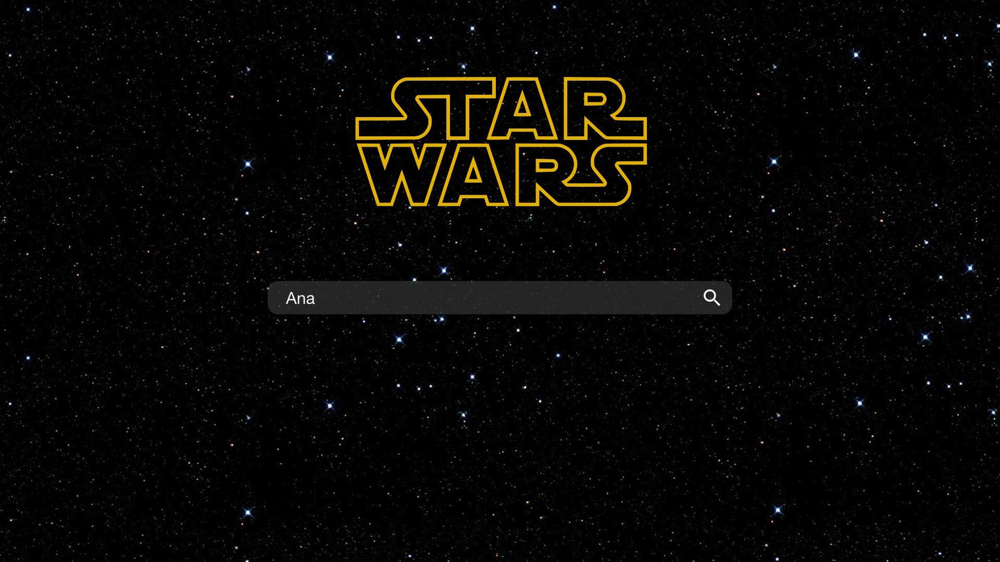
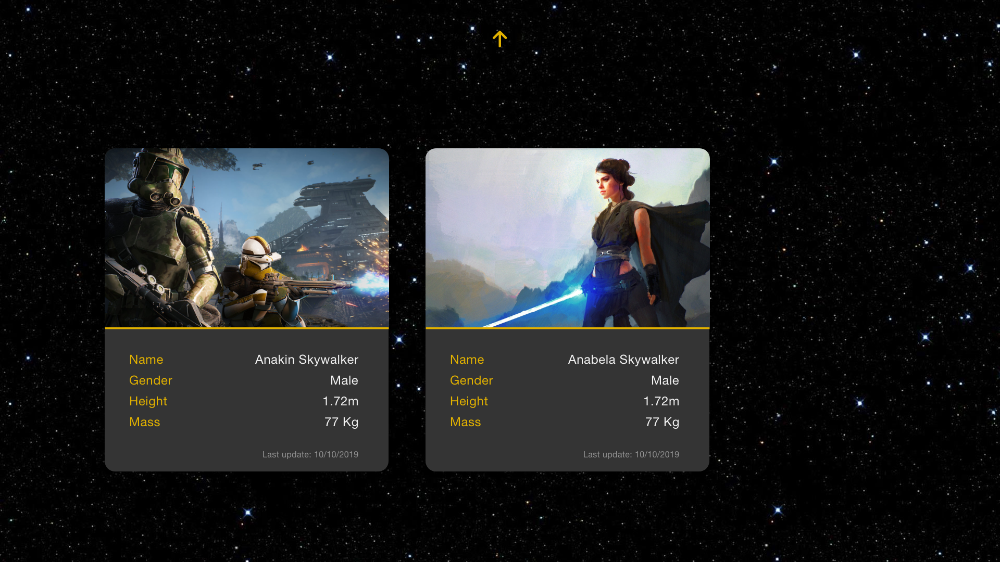
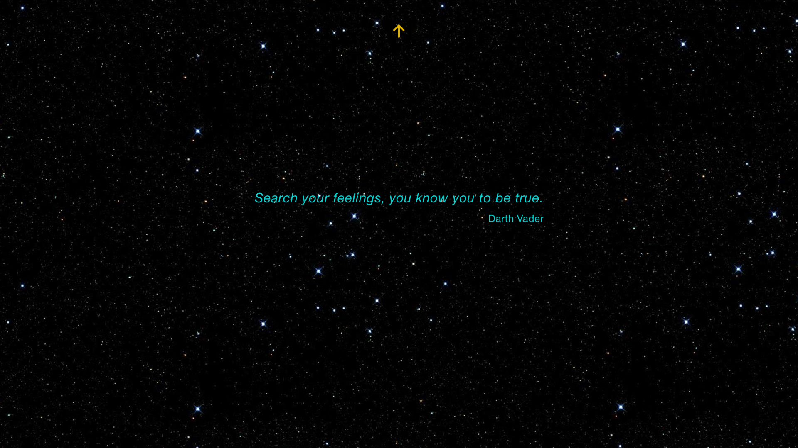

# starwars-react

## Overview

With API from swapi.co, build a single page application where users can view the details about all the people in the Star Wars Universe.

## Demo

To check the live solution click [here](https://pedro-home.github.io/starwars-react/).

## Step-by-step guide

Open your terminal and execute the following commands

### Download application

```
git clone https://github.com/pedro-home/starwars-react.git
cd starwars-react/
```

### Install application

```
npm install
```

### Start application

```
npm start
```

### Test application

```
npm run test
```

## Development Process

### Research

- Check official [Star Wars](https://www.starwars.com/) website, including their [databank](https://www.starwars.com/databank), for designing ideas.

### Planning

- Target time: 3 days (72 hrs) to complete the task
- Use a state management tool
- The code should be in a production-ready state
- View all people in the Star Wars universe
- View the details of every person in the Star Wars universe

### Design & Development

- Component based approach, using technologies
  - React (implement component based architecture)
  - Redux (manage global state)
  - RSuite (provide material components)
  - Jest with @testing-library/react (unit tests)
  - Webpack (build and minify)
  - ESLint, StyleLint and Prettier (clean and simplify code)
  - Babel and PostCSS (support cross browser)

#### Mockups





#### Structure

This is a general representation of the folder structure created

```
starwars-react
├── app               // Source code of the application
│   ├── assets        // Assets used on the application (e.g. background images)
│   ├── components    // Presentational components
│   ├── containers    // Container components
│   ├── contexts      // Context components
│   ├── pages         // Page components
│   ├── providers     // Providers which interact with the store
│   ├── store         // Store configuration and initialization
│   ├── utils         // Utility functions
├── assets            // Assets not used on the application (e.g. mockups)
├── coverage          // Coverage results of unit tests
├── dist              // Built folder
├── internals         // Internal scripts (e.g. webpack)
├── public            // Files added to built folder
```

### Deployment

- This project doesn't support any deployment script.

### Maintenance

For improvements

- Create an error boundary component for rendering and API purposes
- Create a better lodadable component for rendering and API purposes (e.g. using `react-loadable`)
- Create a float button to navigate user to the top of the page

## Commands

### Start the server

```
npm start // For development purposes (i.e. generate source maps)
```

### Build code

```
npm run build:dev  // For development purposes (i.e. generate source maps)
npm run build:prod // For production purposes (i.e. don't generate source maps)
```

### Lint code

```
npm run lint
```

### Run unit tests

```
npm run test       // Also lints the code
npm run test:watch // Executes test script on watch mode
```
